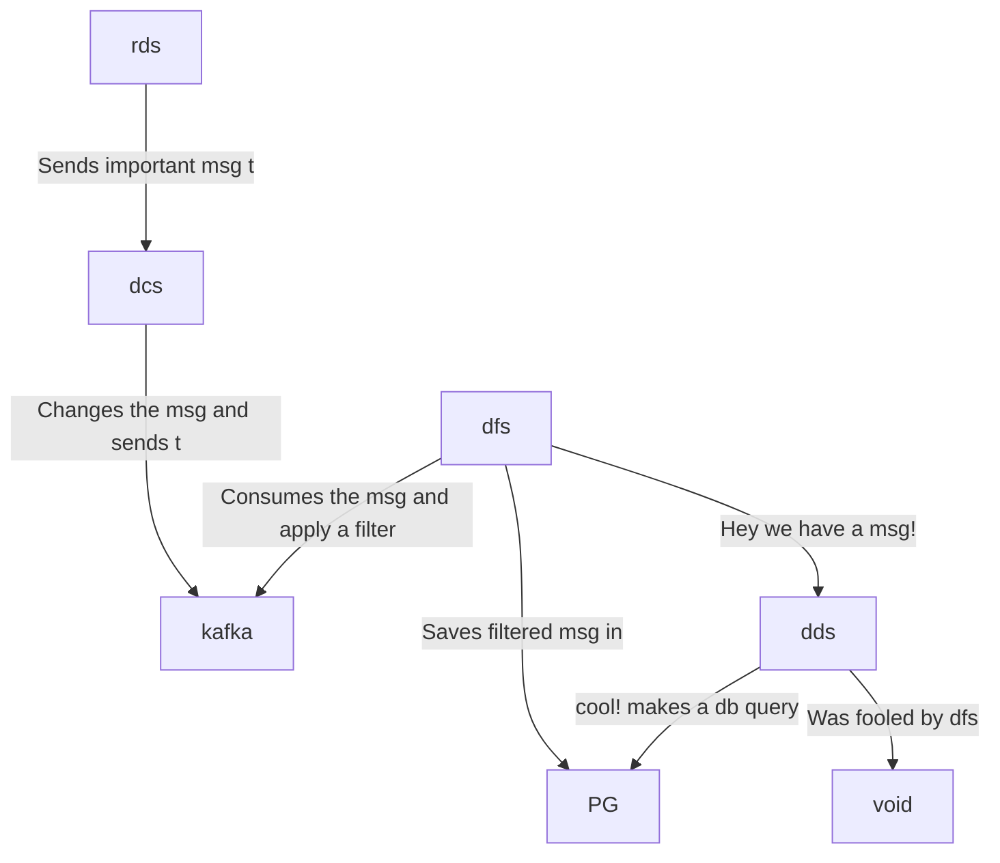

# hyperfoil-test


WIP

```
random-data-service : rds
data-changer-service: dcs
data-filter-service : dfs
display-data-service: dds
postgreesql         : pg
```



Open a terminal and run:

```console
docker-compose up
```

Open other terminal and run

```console
curl 0.0.0.0:8080
```

## Benchmark with Hyperfoil

```console
./get-hf.sh
cd hyperfoil-0.23
./bin/cli.sh
```

```console
[hyperfoil]$ start-local
Starting controller in default directory (/tmp/hyperfoil)
Controller started, listening on 127.0.0.1:33741
Connecting to the controller...
Connected to 127.0.0.1:33741!
```

```console
[hyperfoil@in-vm]$ upload ../otel.hf.yml
Loaded benchmark otel-disabled, uploading...
... done.
``` 

```console
[hyperfoil@in-vm]$ stats
Total stats from run 0001
PHASE  METRIC       THROUGHPUT  REQUESTS  MEAN     p50      p90      p99       p99.9     p99.99    TIMEOUTS  ERRORS  BLOCKED  2xx  3xx  4xx
                    5xx         CACHE
----------------------------------------------------------------------------------------------------------------------------------------------
main   displayData  9.40 req/s        94  2.33 ms  2.54 ms  3.65 ms   4.85 ms   4.85 ms   4.85 ms         0       0     0 ns   94    0    0
                             0         0
----------------------------------------------------------------------------------------------------------------------------------------------
main   randomData   9.40 req/s        94  7.17 ms  7.60 ms  9.63 ms  12.58 ms  12.58 ms  12.58 ms         0       0     0 ns   94    0    0
                             0         0
----------------------------------------------------------------------------------------------------------------------------------------------
```
