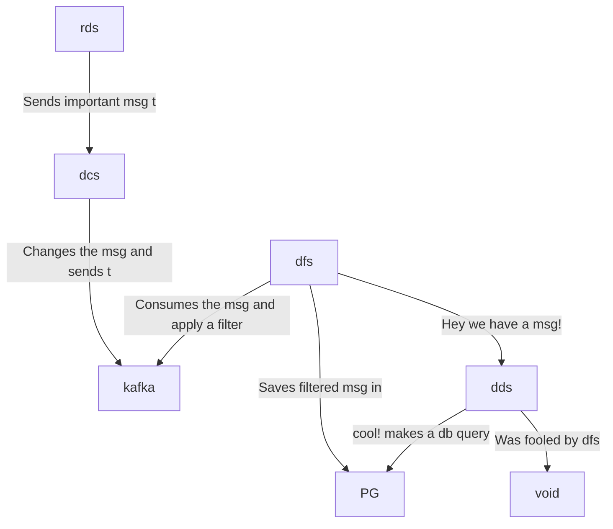

# hyperfoil-test

```
random-data-service  : rds - express                : auto-instrumentation
data-changer-service : dcs - fastify, kafkajs       : auto-instrumentation, manual-instrumentation
data-filter-service  : dfs - kafkajs, socket.io, pg : auto-instrumentation, manual-instrumentation
display-data-service : dds - hapi, socket.io, pg    : auto-instrumentation
postgres             : pg
```



Open a terminal and run:

```console
docker-compose up
```

Open other terminal and run

```console
curl 0.0.0.0:8080
```

