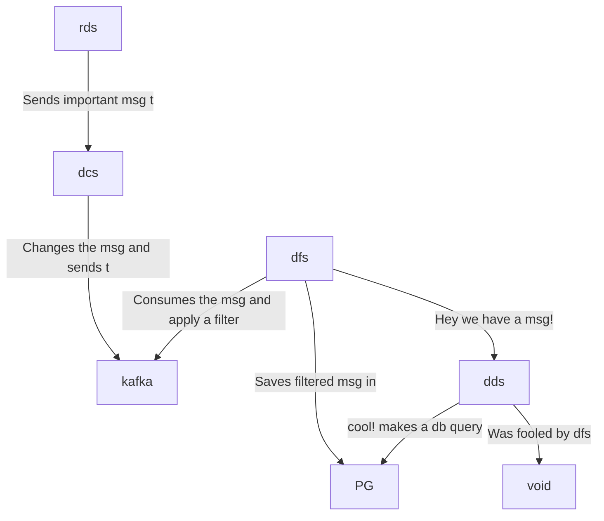

# hyperfoil-test

> OTEL-JS packages in use (both console_exporter branch + otelcol_exporter branch, the difference is `@opentelemetry/exporter-trace-otlp-http` only):

| Package | Why |
| ----------- | ----------- |
| @opentelemetry/exporter-trace-otlp-http | To export to OTEL collector OTLP/HTTP |
| @opentelemetry/resources | To be used with `semantic-conventions` to identify the application/service's name |
| @opentelemetry/sdk-trace-node | For automatic instrumentation |
| @opentelemetry/semantic-conventions | To be used with `resources` to identify the application/service's name |
| @opentelemetry/instrumentation | To register the fetch auto-instrumentation plugin |
| @opentelemetry/instrumentation-fetch | For fetch auto-instrumentation |
| @opentelemetry/instrumentation-fastify | For fastify auto-instrumentation |
| @opentelemetry/instrumentation-http | Required for `@opentelemetry/instrumentation-express`, `@opentelemetry/instrumentation-fastify`, `@opentelemetry/instrumentation-hapi` |
| @opentelemetry/instrumentation-pg | For postgres auto-instrumentation |
| @opentelemetry/instrumentation-hapi | For hapi auto-instrumentation |
| @opentelemetry/instrumentation-socket.io | For socket.io auto-instrumentation |
| @opentelemetry/instrumentation-express | For Express auto-instrumentation |


```
random-data-service : rds
data-changer-service: dcs
data-filter-service : dfs
display-data-service: dds
postgreesql         : pg
```



## Benchmark with Hyperfoil

### Note: If you want to change the number of users or other settings, then change the `otel.hf.yml` file and run the tests.

### Note: After finish this test, you can switch to the other branch `console_exporter` or `otelcol_exporter` and run the tests again with OpenTelemetry enabled

Open a terminal and run:

```console
docker-compose up
```

Open other terminal and run:

```console
./get-hf.sh
cd hyperfoil-0.23
./bin/cli.sh
```

```console
[hyperfoil]$ start-local
Starting controller in default directory (/tmp/hyperfoil)
Controller started, listening on 127.0.0.1:45857
Connecting to the controller...
Connected to 127.0.0.1:45857!
[hyperfoil@in-vm]$ upload ../otel.hf.yml
Loaded benchmark otel-disabled, uploading...
... done.
[hyperfoil@in-vm]$ run
Started run 0003
Run 0003, benchmark otel-disabled
Agents: in-vm[STOPPED]
Started: 2023/01/27 08:37:21.615    Terminated: 2023/01/27 08:37:31.623
NAME  STATUS      STARTED       REMAINING  COMPLETED     TOTAL DURATION               DESCRIPTION
main  TERMINATED  08:37:21.615             08:37:31.622  10007 ms (exceeded by 7 ms)  20.00 users per second
[hyperfoil@in-vm]$ stats
Total stats from run 0003
PHASE  METRIC       THROUGHPUT   REQUESTS  MEAN     p50      p90       p99       p99.9     p99.99    TIMEOUTS  ERRORS  BLOCKED  2xx  3xx  4xx
                    5xx          CACHE
----------------------------------------------------------------------------------------------------------------------------------------------
main   displayData  20.69 req/s       207  1.92 ms  1.60 ms   3.34 ms   4.65 ms   7.18 ms   7.18 ms         0       0     0 ns  207    0    0
                              0         0
----------------------------------------------------------------------------------------------------------------------------------------------
main   randomData   20.69 req/s       207  7.88 ms  7.60 ms  11.01 ms  24.77 ms  72.88 ms  72.88 ms         0       0     0 ns  207    0    0
                              0         0
----------------------------------------------------------------------------------------------------------------------------------------------
```
