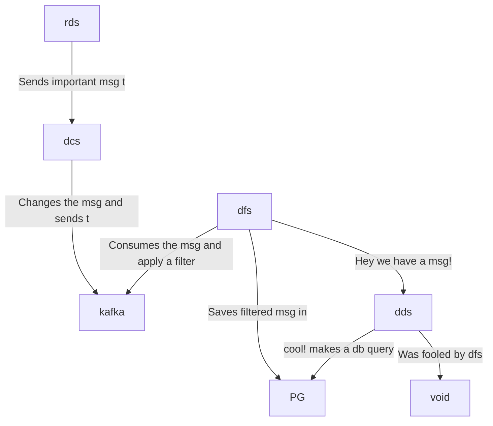

# hyperfoil-test


WIP

```
random-data-service : rds
data-changer-service: dcs
data-filter-service : dfs
display-data-service: dds
postgreesql         : pg
```



Open a terminal and run:

```console
docker-compose up
```

Open other terminal and run

```console
curl 0.0.0.0:8080
```

