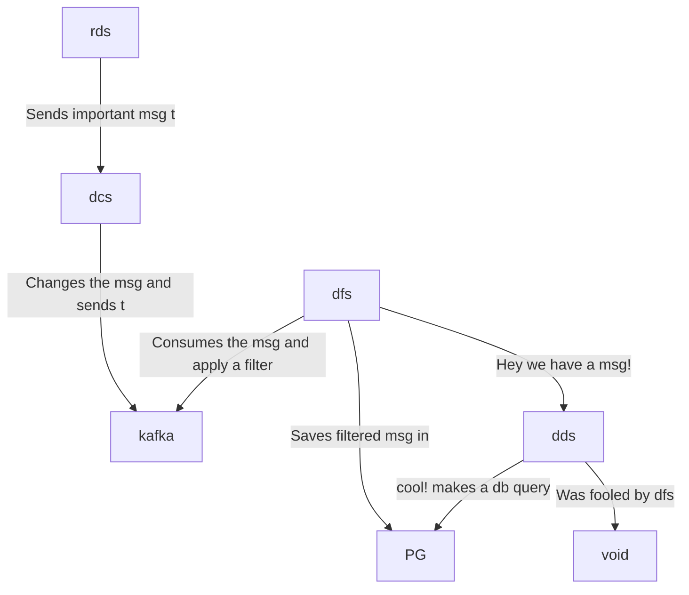

# hyperfoil-test

```
random-data-service  : rds - express                : auto-instrumentation
data-changer-service : dcs - fastify, kafkajs       : auto-instrumentation, manual-instrumentation
data-filter-service  : dfs - kafkajs, socket.io, pg : auto-instrumentation, manual-instrumentation
display-data-service : dds - hapi, socket.io, pg    : auto-instrumentation
postgres             : pg
```



Open a terminal and run:

```console
docker-compose up
```

## Benchmark with Hyperfoil and OTEL-js enabled

Open other terminal and run:

```console
./get-hf.sh
cd hyperfoil-0.23
./bin/cli.sh
```

```console
[hyperfoil]$ start-local
Starting controller in default directory (/tmp/hyperfoil)
Controller started, listening on 127.0.0.1:44439
Connecting to the controller...
Connected to 127.0.0.1:44439!
[hyperfoil@in-vm]$ upload ../otel.hf.yml
Loaded benchmark otel-enabled, uploading...
... done.
[hyperfoil@in-vm]$ run
Started run 0004
Run 0004, benchmark otel-enabled
Agents: in-vm[READY]
Started: 2023/01/27 08:48:06.536
NAME  STATUS   STARTED       REMAINING  COMPLETED  TOTAL DURATION  DESCRIPTION
main  RUNNING  08:48:06.536     913 ms                             20.00 users peAgents: in-vm[STOPPED]
Started: 2023/01/27 08:48:06.536    Terminated: 2023/01/27 08:48:16.544
NAME  STATUS
      STARTED
      REMAINING
      COMPLETED
      TOTAL DURATION
      DESCRIPTION
---------------------------
main  TERMINATED
      08:48:06.536

      08:48:16.543
      10007 ms (exceeded by 7 ms)
      20.00 users per second
---------------------------
[hyperfoil@in-vm]$ stats
Total stats from run 0004
PHASE  METRIC       THROUGHPUT   REQUESTS  MEAN     p50      p90       p99       p99.9     p99.99    TIMEOUTS  ERRORS  BLOCKED  2xx  3xx  4xx
                    5xx          CACHE
----------------------------------------------------------------------------------------------------------------------------------------------
main   displayData  21.09 req/s       211  1.91 ms  1.45 ms   3.15 ms   8.91 ms  10.68 ms  10.68 ms         0       0     0 ns  211    0    0
                              0         0
----------------------------------------------------------------------------------------------------------------------------------------------
main   randomData   21.09 req/s       211  9.15 ms  8.06 ms  13.76 ms  28.57 ms  94.37 ms  94.37 ms         0       0     0 ns  211    0    0
                              0         0
----------------------------------------------------------------------------------------------------------------------------------------------
```
