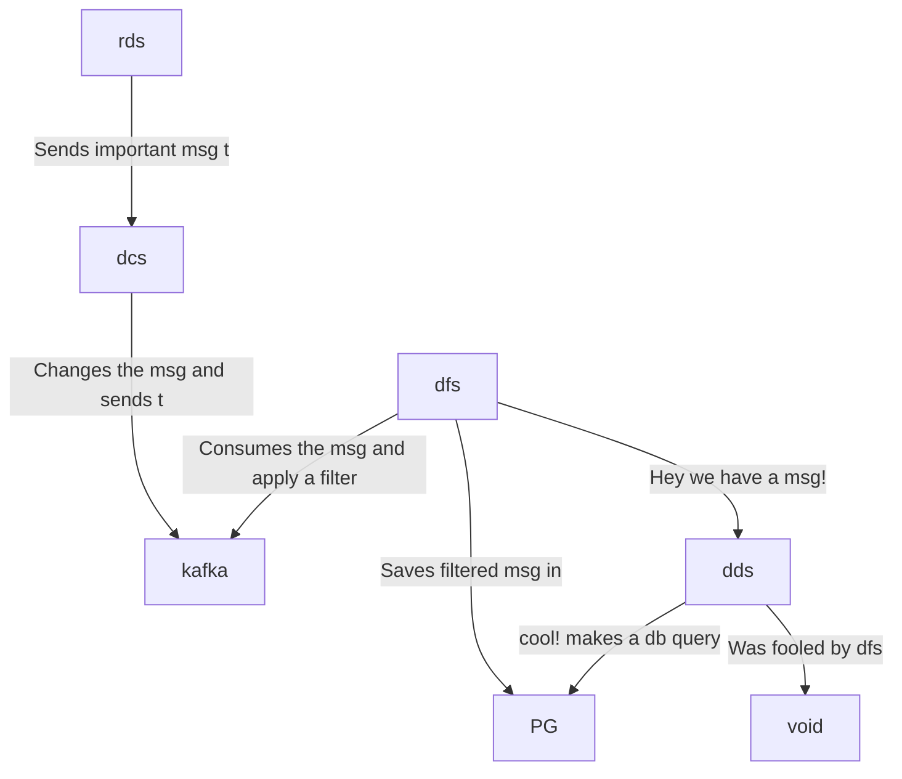

# hyperfoil-test

```
random-data-service  : rds - express                : auto-instrumentation
data-changer-service : dcs - fastify, kafkajs       : auto-instrumentation, manual-instrumentation
data-filter-service  : dfs - kafkajs, socket.io, pg : auto-instrumentation, manual-instrumentation
display-data-service : dds - hapi, socket.io, pg    : auto-instrumentation
postgres             : pg
```



## Benchmark with Hyperfoil and OTEL-js enabled exporting to OTELCOL

### Note: If you want to change the number of users or other settings, then change the `otel.hf.yml` file and run the tests.

Open a terminal and run:

```console
docker-compose up
```

Open other terminal and run:

```console
./get-hf.sh
cd hyperfoil-0.23
./bin/cli.sh
```

```console
[hyperfoil]$ start-local
Starting controller in default directory (/tmp/hyperfoil)
Controller started, listening on 127.0.0.1:36249
Connecting to the controller...
Connected to 127.0.0.1:36249!
[hyperfoil@in-vm]$ upload ../otel.hf.yml
Loaded benchmark otel-enabled, uploading...
... done.
[hyperfoil@in-vm]$ run
Started run 0006
Run 0006, benchmark otel-enabled
Agents: in-vm[STOPPED]
Started: 2023/01/27 10:27:34.015    Terminated: 2023/01/27 10:27:44.026
NAME  STATUS      STARTED       REMAINING  COMPLETED     TOTAL DURATION                DESCRIPTION
main  TERMINATED  10:27:34.015             10:27:44.025  10010 ms (exceeded by 10 ms)  20.00 users per second
[hyperfoil@in-vm]$ stats
Total stats from run 0006
PHASE  METRIC       THROUGHPUT   REQUESTS  MEAN      p50       p90       p99       p99.9      p99.99     TIMEOUTS  ERRORS  BLOCKED  2xx  3xx
                    4xx          5xx       CACHE
----------------------------------------------------------------------------------------------------------------------------------------------
main   displayData  20.68 req/s       207   3.60 ms   3.11 ms   5.73 ms  13.43 ms   18.09 ms   18.09 ms         0       0     0 ns  207    0
                              0         0         0
----------------------------------------------------------------------------------------------------------------------------------------------
main   randomData   20.68 req/s       207  13.75 ms  12.45 ms  20.84 ms  80.22 ms  116.92 ms  116.92 ms         0       0     0 ns  207    0
                              0         0         0
----------------------------------------------------------------------------------------------------------------------------------------------
```
