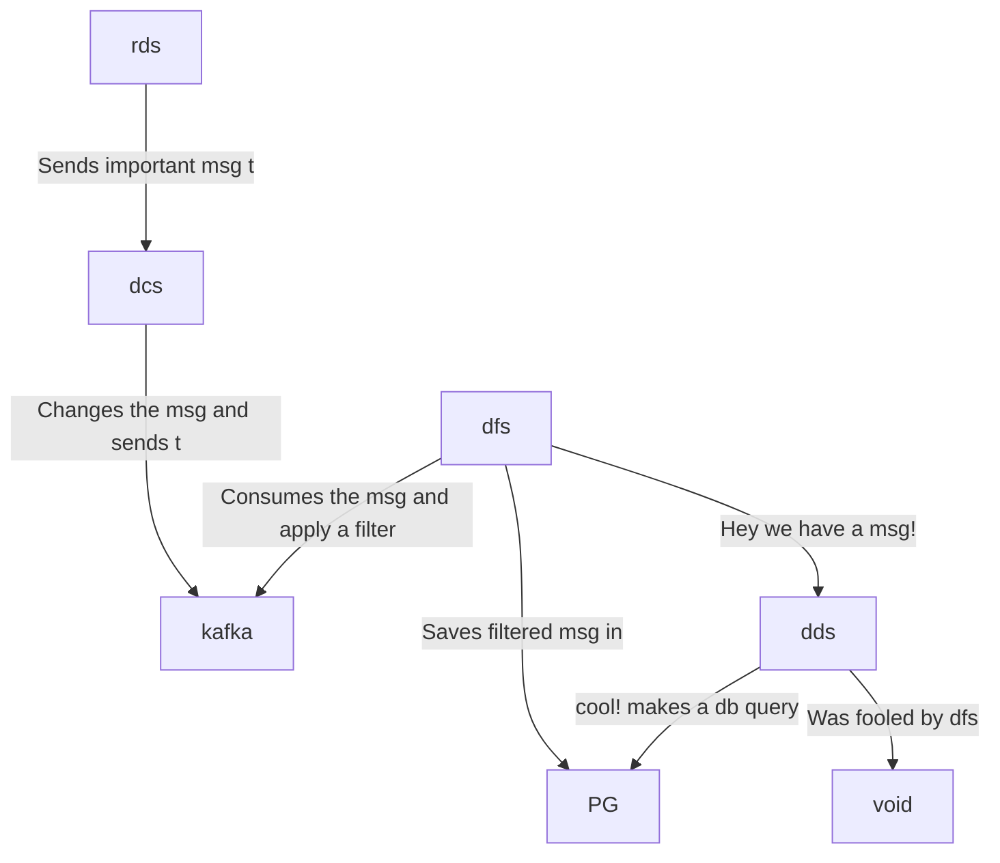

# hyperfoil-test

```
random-data-service  : rds - express                : auto-instrumentation
data-changer-service : dcs - fastify, kafkajs       : auto-instrumentation, manual-instrumentation
data-filter-service  : dfs - kafkajs, socket.io, pg : auto-instrumentation, manual-instrumentation
display-data-service : dds - hapi, socket.io, pg    : auto-instrumentation
postgres             : pg
```



Open a terminal and run:

```console
docker-compose up
```

Open other terminal and run

```console
curl 0.0.0.0:8080
```


## Benchmark with Hyperfoil and OTEL-js enabled

```console
./get-hf.sh
cd hyperfoil-0.23
./bin/cli.sh
```

```console
[hyperfoil]$ start-local
Starting controller in default directory (/tmp/hyperfoil)
Controller started, listening on 127.0.0.1:33741
Connecting to the controller...
Connected to 127.0.0.1:33741!
```

```console
[hyperfoil@in-vm]$ upload ../otel.hf.yml
Loaded benchmark otel-disabled, uploading...
... done.
``` 

```console
[hyperfoil@in-vm]$ run
Started run 0002
Run 0002, benchmark otel-disabled
Agents: in-vm[READY]
Started: 2023/01/27 08:23:16.624
NAME  STATUS   STARTED       REMAINING  COMPLETED  TOTAL DURATION  DESCRIPTION
main  RUNNING  08:23:16.624    1884 ms                             10.00 users per second
Agents: in-vm[READY]
Started: 2023/01/27 08:23:16.624
NAME  STATUS
      STARTED
      REMAINING
Agents: in-vm[STOPPED]
Started: 2023/01/27 08:23:16.624    Terminated: 2023/01/27 08:23:26.634
NAME  STATUS
      STARTED
      REMAINING
      COMPLETED
      TOTAL DURATION
      DESCRIPTION
-----------------------
main  TERMINATED
      08:23:16.624

      08:23:26.633
      10009 ms (exceeded by 9 ms)
      10.00 users per second
-----------------------
[hyperfoil@in-vm]$ stats
Total stats from run 0002
PHASE  METRIC       THROUGHPUT  REQUESTS  MEAN      p50      p90       p99       p99.9     p99.99    TIMEOUTS  ERRORS  BLOCKED  2xx  3xx  4xx
                    5xx         CACHE
----------------------------------------------------------------------------------------------------------------------------------------------
main   displayData  8.99 req/s        90   1.98 ms  1.64 ms   3.16 ms   8.06 ms   8.06 ms   8.06 ms         0       0     0 ns   90    0    0
                             0         0
----------------------------------------------------------------------------------------------------------------------------------------------
main   randomData   8.99 req/s        90  11.11 ms  9.96 ms  15.27 ms  94.37 ms  94.37 ms  94.37 ms         0       0     0 ns   90    0    0
                             0         0
----------------------------------------------------------------------------------------------------------------------------------------------
```
